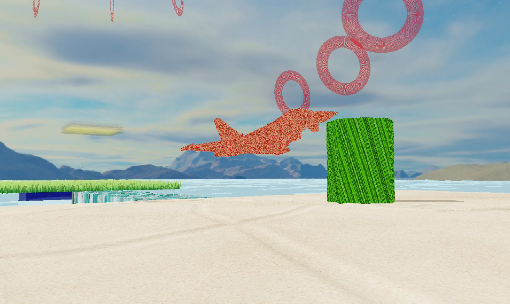
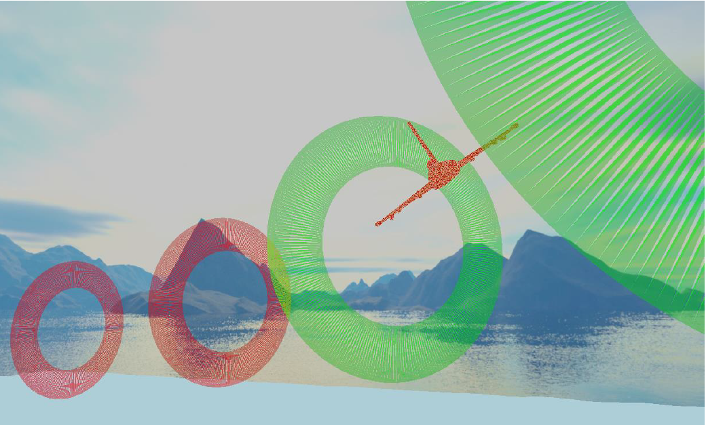

# CGProject

Solve a puzzle, grab a plane, and then ... get ready for more challenges!

The .exe file is in `/executable`.  However, you are advised to recompile the VS project in `/code` to ensure that all OpenGL dependencies are linked correctly. The 

