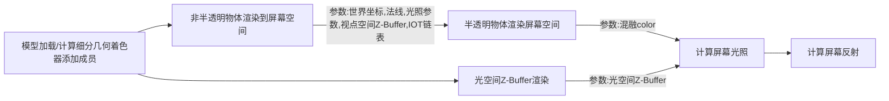
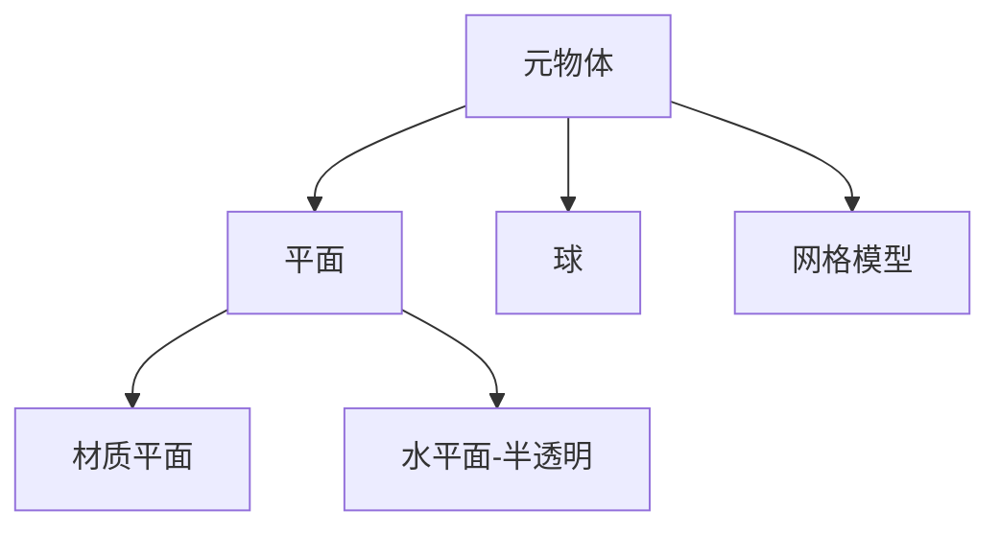
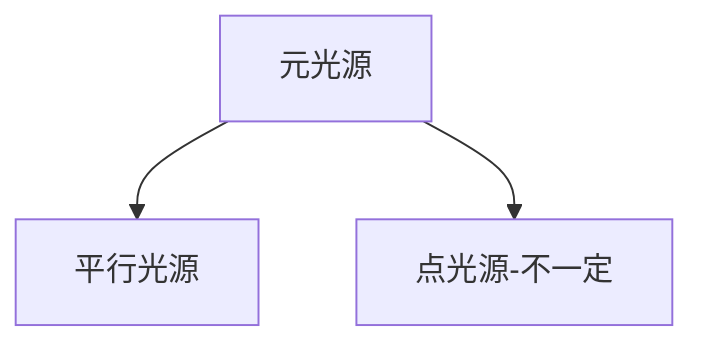
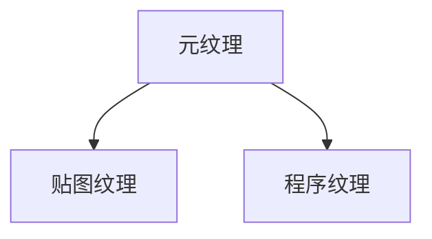

# Structure
### 大致GBuffer渲染流程

```mermaid
graph LR
   模型加载/计算细分几何着色器添加成员 --> 非半透明物体渲染到屏幕空间 -->|参数:世界坐标,法线,光照参数,视点空间Z-Buffer,IOT链表| 半透明物体渲染屏幕空间
   模型加载/计算细分几何着色器添加成员 --> 光空间Z-Buffer渲染
   半透明物体渲染屏幕空间 -->|参数:混融color| 计算屏幕光照
   光空间Z-Buffer渲染 -->|参数:光空间Z-Buffer| 计算屏幕光照
   计算屏幕光照 --> 计算屏幕反射
```
### 大致模型继承

```mermaid
graph TD
	元物体 --> 平面
	平面 --> 材质平面
	元物体 --> 球
	平面 --> 水平面-半透明
	元物体 --> 网格模型
```
### 大致光源继承

```mermaid
graph TD
	元光源 --> 平行光源
	元光源 --> 点光源-不一定
```
### 大致纹理继承

```mermaid
graph TD
	元纹理 --> 贴图纹理
	元纹理 --> 程序纹理
```
噪声腐蚀效果